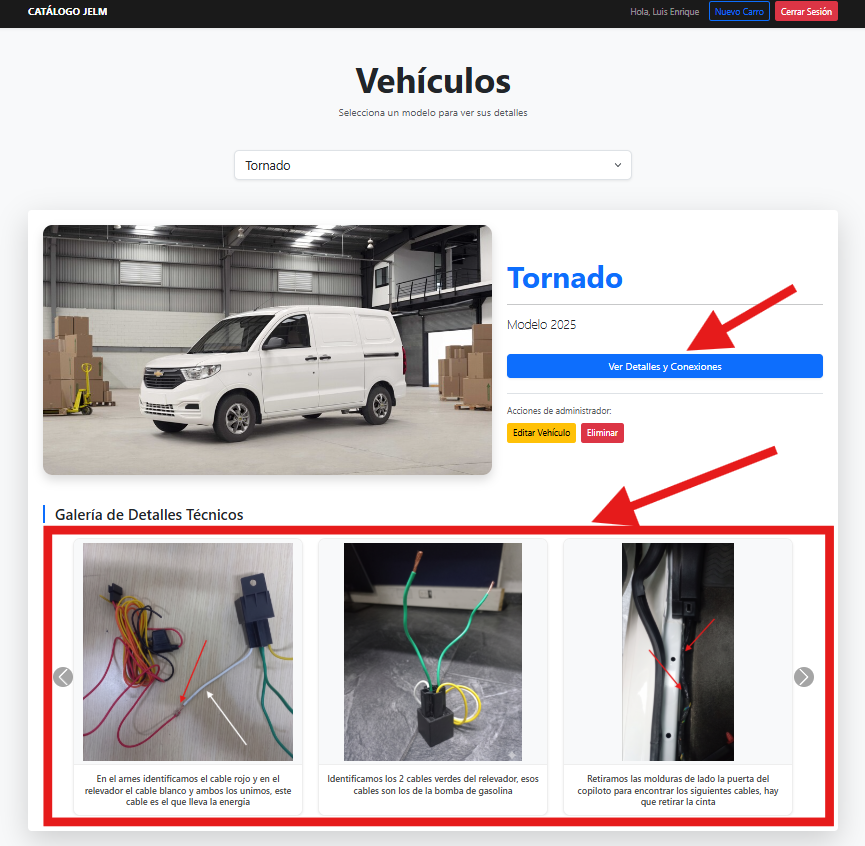

# 🚗 GPS Installation & Vehicle Catalog System

Sistema web interactivo desarrollado como un manual técnico digital avanzado para instaladores y técnicos de flotillas. La plataforma centraliza y organiza diagramas de cableado, relevadores, ubicaciones de bloqueos de motor y guías fotográficas paso a paso para la correcta integración de dispositivos GPS, mapeados minuciosamente según la marca, modelo y año del vehículo.

---

## 🚀 Características Principales

- **Módulo de Autenticación Seguro:** Pantalla de acceso restringido para asegurar que solo los técnicos e instaladores autorizados puedan consultar la documentación y esquemas eléctricos sensibles.
- **Buscador Avanzado y Selección de Vehículos:** Filtro dinámico e intuitivo que permite seleccionar Marca, Modelo y Año para desplegar de forma inmediata la ficha técnica específica de instalación.
- **Fichas Técnicas Detalladas (Paso a Paso):** Visualización interactiva de instrucciones críticas que incluyen:
  - Ubicación exacta de las líneas de corriente, ignición y tierras.
  - Diagramas de corte de bomba de combustible o marcha (bloqueo de motor).
  - Puntos de fijación ideales para ocultar el dispositivo GPS dentro del tablero.
- **Panel Administrativo (CRUD Completo):** Interfaz robusta para administradores o ingenieros de soporte que permite registrar nuevos vehículos, editar diagramas existentes, actualizar colores de cables de referencia y subir nuevas evidencias fotográficas del proceso.

---

## 🛠️ Stack Tecnológico

- **Backend:** PHP / Laravel (Estructura robusta de rutas, controladores de administración y consultas óptimas mediante Eloquent ORM).
- **Frontend:** JavaScript (ES6+), Blade Templates integrados dinámicamente con estilos modernos.
- **UI & Estilos:** Tailwind CSS / Bootstrap (Diseño completamente responsivo, pensado para que el técnico pueda consultar el manual cómodamente desde su teléfono celular en el taller o campo).
- **Base de Datos:** MySQL (Base de datos relacional que vincula de manera estricta marcas, modelos, años y la secuencia lógica de pasos de instalación).

---
## 📸 Vista Previa de la Interfaz

### 🔒 Control de Acceso Profesional

### 🔍 Catálogo Principal y Selección de Flota

### 📋 Visualización General del Manual Técnico

### 🛠️ Guías Fotográficas e Instrucciones de Conexión

### 📝 Panel de Administración y Modificación de Guías

